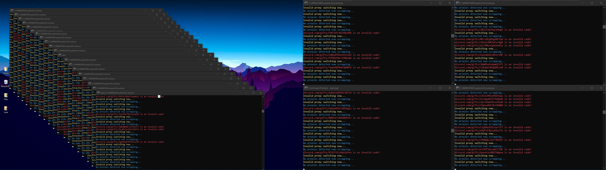
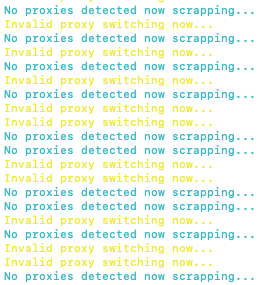
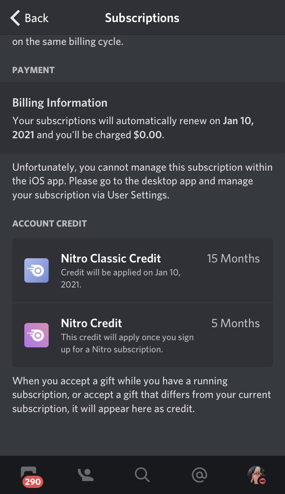

## About The Project

Very basic random string generator in discord nitro code format with built in checker utilising discords gift code verification api

## Getting Started

To get a local copy up and running follow these simple steps.

### Prerequisites

`node.js`

### Changelog

Full detailed changelog can be viewed [here](https://github.com/therealtear/discord-nitro-generator/issues/25) latest changes will be listed below:

+ QnA readme improvement

+ Formatting

+ Clean up

+ Add replit branch

### QnA

Q: "hrrrrrr it no worky"

A: stfu and read the ENTIRE readme and check the closed issues before spamming my DMs and the server with a question that's already been answered 40 other times

Q: "How long does it take?"

A: Since I do not feel like writing an essay at 5am basically it's random, could take 20 minutes, could take 20 hours, depends on a lot of different factors such as how many valid codes are in Discord's DB at any given time, how many people are running the generator at the same time (barely effects odds but can cause proxy use overlapping) as well as your internet/PC reliability.

Q: "I'm running 50 instances simultaneously and its not working!!1! >:("

A: Only run a MAXIMUM of 1 nitro generator at a time using proxied requests and 1 non-proxied request version at any point in time running more then one will cause proxy scrapper overlays and just rate limit each other causing the generator to run MUCH slower then normal! Don't be this guy: 

Q: "My screen looks like this: 

 

What do I do?

A: Either go to https://proxyscrape.com/free-proxy-list or another proxy dumping site and download and add new proxies to proxies.txt or wait for the generator to scrape new ones, if you do not start recieving the normal "Invalid code" response then remove all proxies and add new ones.

Q: "OMG THE FIRST STEP (npm i) MADE IT HAVE WARNING!!11!!!1! WHAT DO????? (pic related) 

A: Nothing! it's perfectly fine request just happens to no longer be maintained (meaning it is not recieving new updates) and nothing is wrong! :) Move on to the next step and enjoy.

### Installation on Windows

Step 1) Download and extract the folder from this .zip file

Step 2) Go to https://nodejs.org/en/download/ and download and install Node.js LTS for Windows using nodes instructions

Step 3) Run the .bat file labeled "install_and_run.bat" and wait for it to finish installing the node modules

Step 4) Run the .bat file labeled "start.bat"

Step 5) Copy and paste your HTTP proxy list into proxies.txt. If you do not have any proxy lists I recommend downloading yours off of https://proxyscrape.com/free-proxy-list they're free and easy to use

Step 6) Follow the prompts in your CMD and start the generator!

### Installation on MacOS and Linux

Step 1) Download and extract the folder from this .zip file

Step 2) Go to https://nodejs.org/en/download/ and download Node.js LTS for whichever OS you are using then install it with nodes instructions

Step 3) Please open terminal and cd to this folder then type "npm i" or right click on this folder and select "New terminal at folder" and wait for it to finish installing the node modules

Step 4) Please open terminal and cd to this folder then type "node app.js" or right click on this folder and select "New terminal at folder"

Step 5) Copy and paste your HTTP proxy list into proxies.txt. If you do not have any proxy lists I recommend downloading yours off of https://proxyscrape.com/free-proxy-list they're free and easy to use

Step 6) Follow the prompts in your terminal and start the generator!

## Issues

See the [open issues](https://github.com/therealtear/discord-nitro-generator/issues) for a list of proposed features (and known issues).

## Proof Of Concept (Running generator for 24 hours straight)

## License

See `Software License Agreement.txt` for more information.

## Contact
If you have any issues or questions please contact me at tear@crime.su or on Discord at tear#9999

Email: tear@crime.su

Discord: tear#9999

Project Link: [https://github.com/therealtear/discord-nitro-generator/](https://github.com/therealtear/discord-nitro-generator/)

# Disclaimer

This tool is for education/research purposes only. The author takes NO responsibility and/or liability for how you choose to use any of the tools/source code/any files provided. The author and anyone affiliated with will not be liable for any losses and/or damages in connection with use of ANY files provided with this tool. By using this tool or any files included, you understand that you are AGREEING TO USE AT YOUR OWN RISK. Once again this tool and ALL files included are for EDUCATION and/or RESEARCH purposes ONLY. This tool is ONLY intended to be used on your own pentesting labs, or with explicit consent from the owner of the property being tested.

tl;dr
I'm not responsible if u use this illegally lol

# Donations

Feel free to donate if you like any of my projects and want to support me :)

Monero: 441WXXbQe48PifR3mkWkK73rgnq1AKovKYSTpZFQAz76e88dKnhKt7q9Gxb6nhg7J9EKaTRXWWnVEL5DDQG41j4pGrkuawt
Paypal: palpal.me/jacob69smith
